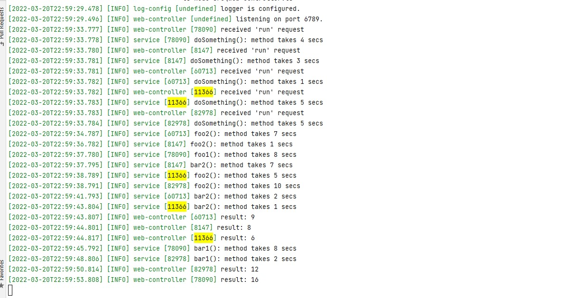

# express-with-correlator

    ts-node src\web-controller.ts

if we call 5 - only 5 - parallel calls to `/run`, the result would be:

this is impossible to debug or to analyze issues because we cannot tell which log comes from which run (no threads in node.js!).

