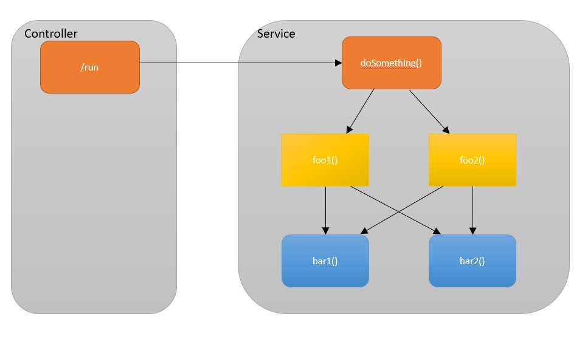

# express-with-correlator

    ts-node src\web-controller.ts

## the challenge

I was developing a web-server implemented in Node.js, serving lots of clients and requests. From time to time we were *trying 
to* troubleshoot  
problems by using the logs. We realized that if we do not maintain a correlator for each client-request, it is impossible to know which log-line
came from which call/request. Thus, flow could not be inspected and troubleshooting problems was hardly possible.

## demonstration

To simulate the use case, we have a simple web controller that calls a service. Usually, most of the logic resides in the 
service layer, and calls go through different files and functions not mentioning invoking 3rd parties. I wanted to show
the simplest example, yet to be problematic enough to illustrate the challenge. For this, I wrote the service below. There
is an entrypoint, `doSomething()` which is 'heavy' and takes time - in this case it sleeps random (1-10) number of seconds.
Then is calls randomly to `foo1()` or `foo2()`. Each one of them does similar thing (heavy work - random time of sleep) and calls
randomly to another layer - `bar1()` or `bar2()`. 

For this example it is important that every function sleeps random time
because it illustrates real-life flow, where functions take different of time and logically call other functions. Thus, it
is very difficult to understand from the logs which call came from which caller-function.

if we call 5 - only 5 - parallel calls to `/run`, the result would be:

this is impossible to debug or to analyze issues because we cannot tell which log comes from which run (no threads in node.js!).

**The challenge consists of 2 parts**:
* First, indicating all logs from the same request with a unique correlator.
* Second, adding this correlator to every log line without refactoring all the code.

In Java, for example, each call to the web-server is handled by a thread, and unless a new thread is created on purpose, the
developer can always query for the thread-id, or store some data on the [ThreadLocal](https://docs.oracle.com/javase/7/docs/api/java/lang/ThreadLocal.html).
Need to note that this pattern is relevant [not only for java](https://en.wikipedia.org/wiki/Thread-local_storage).
Alas, node.js works differently and except the event-loop, all logic happens in the same worker thread.

